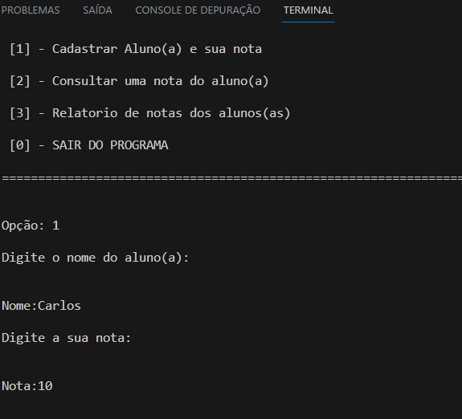
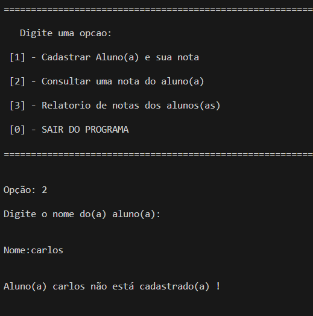

## 💻 Projeto

Programa de uma Ata eletrônica em JavaScript que oferece 3 opções ao usuário:

1 - Cadastrar novo aluno  
2 - Consultar aluno  
3 - Gerar um relatório de todos os alunos  

## Adicionando aluno  

## Consultando aluno  

## Tecnologia utilizada:

 

O projeto foi desenvolvido em JavaScript onde os dados informados pelo usuário será guardado em um array de objetos que está em um arquivo js externo. Onde foi realizado o exports dos dados para o código no arquivo index.

